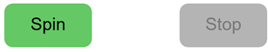

# Slot Machine Exercise

## Introduction

In this exercise, you will build a simple _Slot Machine_ application. Slot Machines are popular gambling devices where players insert coins and spin multiple reels. If the symbols on the reels match in specific patterns, the player wins a prize.

## Basic Requirements

The following requirements are **mandatory** to pass the exercise:

### Project Setup

1. Accept the GitHub Classroom assignment [https://classroom.github.com/a/otvNg9_r](https://classroom.github.com/a/otvNg9_r)
2. Follow the necessary steps to run the starter code on your computer
3. Copy the `Sheet_Fruits_Panel.png` image file to the appropriate folder to make it accessible to your code

### Sprite Sheet

- Examine the `Sheet_Fruits_Panel.png` image file carefully. This sprite sheet contains icons for the slot machine
- Each icon has dimensions of 96×96 pixels
- Select any single row from the sprite sheet based on your preference. These icons will become the symbols for your slot machine reels
- You may ignore the other rows in the sprite sheet after selecting your preferred row

### "Spinning" Reels

* Display four reels side by side
* When the program starts, show a random icon from your chosen row in each reel. **Tip:** Use the _image_ function's variant with 9 arguments to display the icons (as we practiced in the course)

* Create two buttons using p5 (not HTML): "Spin" and "Stop"
  * **Note:** HTML buttons are not allowed as they weren't covered in the course

* When the user clicks "Spin":
  * Display randomly changing icons from your chosen row in each reel in quick succession
  * **Tip:** The `setInterval` method can help achieve this effect

* When the user clicks "Stop":
  * The reels stop changing icons and remain fixed
  * The user can press "Spin" again to restart the spinning animation

* After stopping the reels, analyze the results:
  * If all icons are different: Display "No match"
  * If two icons match: Display "Two of a kind"
  * If three icons match: Display "Three of a kind"
  * If all four icons match: Display "Jackpot!"
  * Clear this text when "Spin" is pressed again

## Advanced Requirements

* Create visual feedback for button states:
  * When reels are not spinning: Indicate that only "Spin" is clickable
  * When reels are spinning: Indicate that only "Stop" is clickable
  * **Tip:** Use e.g. lighter colors for the inactive button

* Implement credit system:
  * Start the player with 10 credits
  * Display the remaining credits clearly on screen

* Credit management:
  * Deduct one credit when "Spin" is pressed
  * If no credits remain, display a message that spinning is not possible
  * Award credits based on matches after stopping:
    * No matches: No credits returned
    * Two matches: Get the deducted credit back (1 credit)
    * Three matches: Get two credits back
    * Four matches: Get four credits back

## Code Quality Requirements

* **Avoid code duplication** - create functions for repeated operations
* Use **meaningful names** for variables and functions
* Minimize unnecessary global variables
* **Important:** Do not use programming language or framework features not covered in the course
  * If you do use such features (e.g., from AI suggestions), you **must be able to explain them in detail** in the next lesson
  * Unexplainable code will be marked as incorrect
