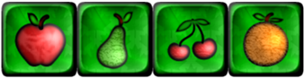
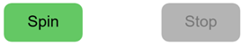
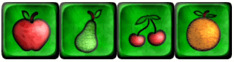
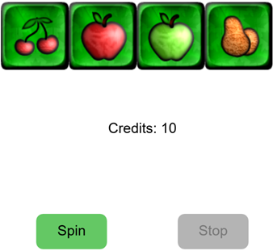

# Spielautomat Übung

## Einführung

In dieser Übung werden Sie eine einfache _Spielautomaten_ Anwendung erstellen. Spielautomaten sind beliebte Glücksspielgeräte, bei denen Spieler Münzen einwerfen und mehrere Walzen drehen. Wenn die Symbole auf den Walzen in bestimmten Mustern übereinstimmen, gewinnt der Spieler einen Preis.

## Grundlegende Anforderungen

Die folgenden Anforderungen sind **verpflichtend**, um die Übung zu bestehen:

### Projekt-Setup

1. Akzeptieren Sie die GitHub Classroom-Aufgabe [TODO: GH Classroom Link hinzufügen](...)
2. Führen Sie die notwendigen Schritte durch, um den Starter-Code auf Ihrem Computer auszuführen
3. Kopieren Sie die Bilddatei `Sheet_Fruits_Panel.png` in den entsprechenden Ordner, damit Ihr Code darauf zugreifen kann

### Sprite Sheet

- Schauen Sie sich die Bilddatei `Sheet_Fruits_Panel.png` sorgfältig an. Dieses Sprite-Sheet enthält Symbole für den Spielautomaten
- Jedes Symbol hat eine Größe von 96×96 Pixeln
- Wählen Sie eine beliebige Zeile aus dem Sprite-Sheet nach Ihrem Geschmack. Diese Symbole werden die Symbole für Ihre Spielautomatenwalzen
- Sie können die anderen Zeilen im Sprite-Sheet ignorieren, nachdem Sie Ihre bevorzugte Reihe festgelegt haben

### "Drehende" Walzen

* Zeigen Sie vier "Walzen" nebeneinander an
* Wenn das Programm startet, zeigen Sie ein zufälliges Symbol aus Ihrer gewählten Reihe in jeder "Walze". **Tipp:** Verwenden Sie die Variante der _image_-Funktion mit 9 Argumenten, um die Symbole anzuzeigen (wie wir es im Kurs geübt haben)

* Erstellen Sie zwei Buttons mit p5 (nicht HTML): "Drehen" und "Stopp"
  * **Hinweis:** HTML-Buttons sind nicht erlaubt, da sie im Kurs nicht behandelt wurden

* Wenn der Benutzer auf "Drehen" klickt:
  * Zeigen Sie in schneller Folge zufällig wechselnde Symbole aus Ihrer gewählten Reihe in jeder Walze an
  * **Tipp:** Die Methode `setInterval` kann helfen, diesen Effekt zu erzielen

* Wenn der Benutzer auf "Stopp" klickt:
  * Die Walzen hören auf, die Symbole zu wechseln und bleiben fixiert
  * Der Benutzer kann "Drehen" erneut drücken, um die Drehanimation neu zu starten

* Nach dem Stoppen der Walzen analysieren Sie die Ergebnisse:
  * Wenn alle Symbole unterschiedlich sind: Zeigen Sie "Keine Übereinstimmung" an
  * Wenn zwei Symbole übereinstimmen: Zeigen Sie "Zwei gleiche" an
  * Wenn drei Symbole übereinstimmen: Zeigen Sie "Drei gleiche" an
  * Wenn alle vier Symbole übereinstimmen: Zeigen Sie "Jackpot!" an
  * Löschen Sie diesen Text, wenn "Drehen" erneut gedrückt wird

## Erweiterte Anforderungen

* Erstellen Sie visuelle Rückmeldungen für Button-Zustände:
  * Wenn die Walzen sich nicht drehen: Zeigen Sie an, dass nur "Drehen" anklickbar ist
  * Wenn die Walzen sich drehen: Zeigen Sie an, dass nur "Stopp" anklickbar ist
  * **Tipp:** Verwenden Sie z.B. hellere Farben für den inaktiven Button

* Implementieren Sie ein Guthaben-System:
  * Der Spiler startet mit 10 Guthaben
  * Zeigen Sie das verbleibende Guthaben deutlich auf dem Bildschirm an

* Guthaben-Verwaltung:
  * Ziehen Sie ein Guthaben ab, wenn "Drehen" gedrückt wird
  * Wenn kein Guthaben mehr vorhanden ist, zeigen Sie eine Meldung an, dass das Drehen nicht möglich ist
  * Vergeben Sie Guthaben basierend auf Übereinstimmungen nach dem Stoppen:
    * Keine Übereinstimmungen: Kein Guthaben zurück
    * Zwei Übereinstimmungen: Erhalten Sie das abgezogene Guthaben zurück (1 Guthaben)
    * Drei Übereinstimmungen: Erhalten Sie zwei Guthaben zurück
    * Vier Übereinstimmungen: Erhalten Sie vier Guthaben zurück

## Anforderungen an die Codequalität

* **Vermeiden Sie Code-Duplizierung** - erstellen Sie Funktionen für wiederholte Operationen
* Verwenden Sie **aussagekräftige Namen** für Variablen und Funktionen
* Minimieren Sie unnötige globale Variablen
* **Wichtig:** Verwenden Sie keine Programmiersprachen- oder Framework-Funktionen, die nicht im Kurs behandelt wurden
  * Wenn Sie solche Funktionen verwenden (z.B. aus KI-Vorschlägen), **müssen Sie in der Lage sein, sie in der nächsten Lektion im Detail zu erklären**
  * Nicht erklärbarer Code wird als falsch markiert